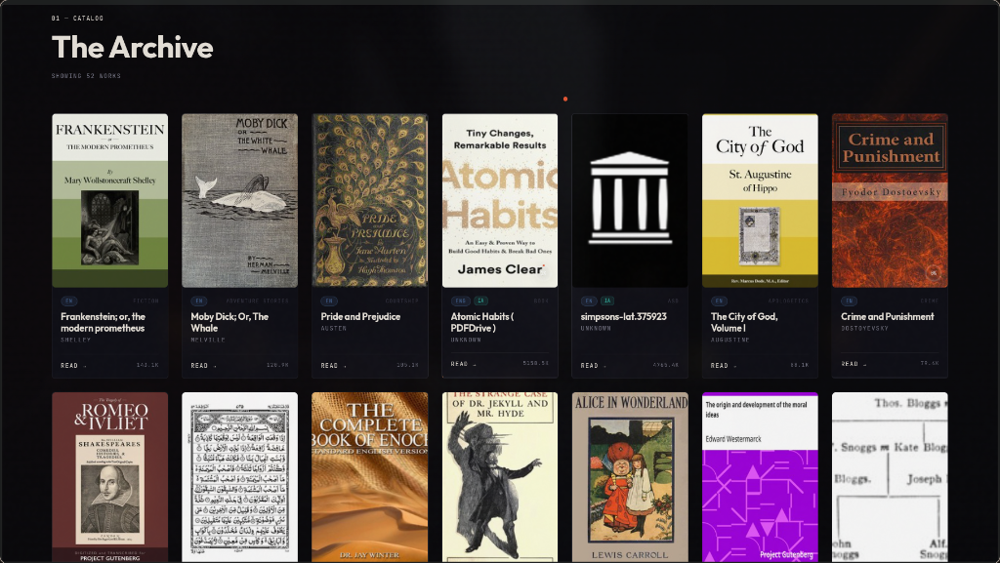
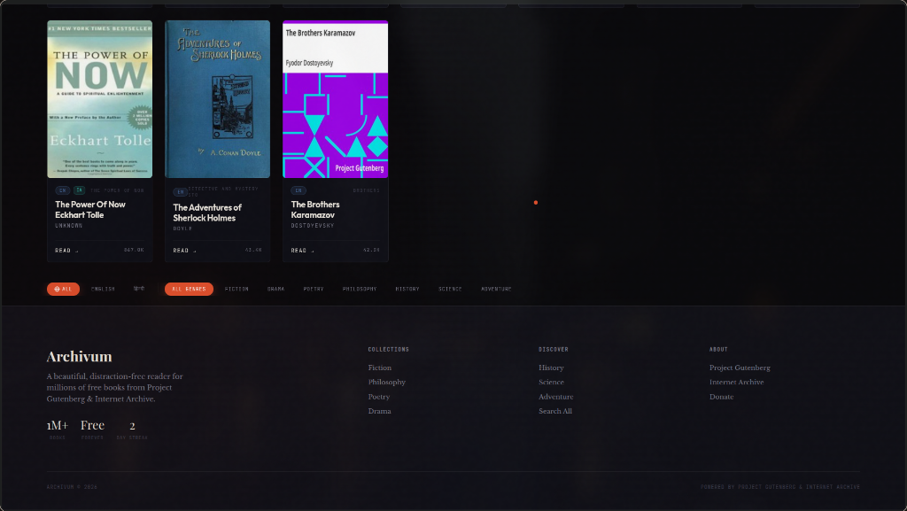
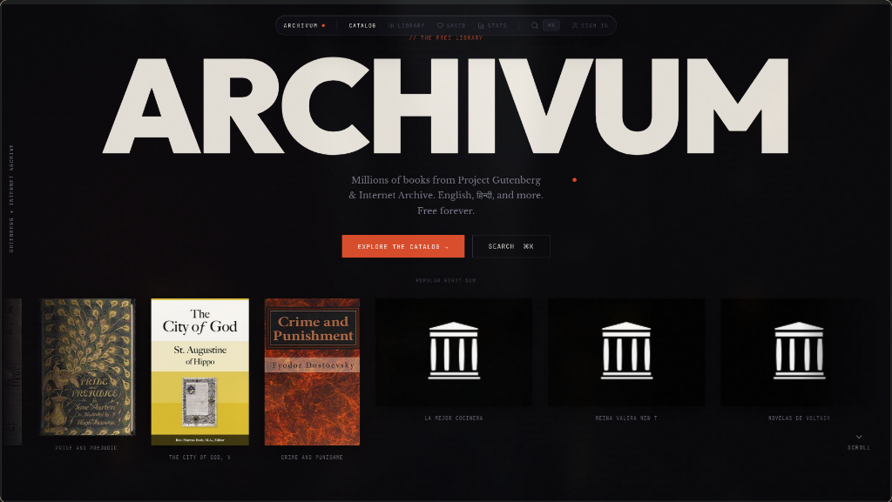

# 🏛️ Archivum

Archivum is a premium, high-fidelity digital library and e-reading application designed for the modern web. Built with React and Vite, it acts as a gatekeeper to the world's greatest literature by integrating search and text fetching from **Project Gutenberg** and the **Internet Archive**. 

The app features a custom, high-performance in-memory reading engine, robust offline features, text-to-speech engine integration, customizable typography, and a modern reading tracker.

---

## 🎨 Application Screenshots

### Premium Catalog & Curated Suggestions


### Dynamic Book Discovery Grid


### Curated Collection Details


---

## ✨ Features

- **📖 Chapter-by-Chapter Reader**: Unlike naive e-readers that load entire books into the DOM (causing massive performance lag), Archivum splits raw Gutenberg/Internet Archive HTML in-memory. It constructs clean, paginated columns and loads exactly one chapter at a time.
- **📱 Responsive Layout Adaptivity**: Dual-page spread layout with horizontal page flips for desktop screens, automatically transitioning to a clean single-column scroll or swipe layout on mobile interfaces.
- **🎙️ Speech Synthesis (TTS)**: Native text-to-speech narration built directly into the reader. Adjust rate, pause/resume, and choose from available system voices.
- **✍️ Interactive Highlighting**: Highlight text selections, add annotations, and persist highlights to Supabase.
- **⚡ Advanced Proxy Chain fallback**: High availability data fetching using a robust fallback mechanism:
  1. Serverless Edge function proxy (`/api/proxy`)
  2. Public CORS proxy backup (`corsproxy.io`)
  3. Direct connection fallback
- **🔥 Gamified Reading Streaks**: Dynamic interactive heatmap tracker visualization of your reading consistency, maintaining local/synced streak metrics.
- **🛠️ Fully Customizable Reader Environment**: Tweak body font sizes, line heights, page margins, and fonts (Georgia, Libre Baskerville, Serif) on the fly to suit your reading preference.
- **💾 Local and Cloud Syncing**: Add books to your personal library, track your progress automatically via Cloud databases (Supabase), and continue reading offline.

---

## 🛠️ Architecture & Tech Stack

- **Frontend Framework**: [React 19](https://react.dev/) + [Vite](https://vite.dev/)
- **Animation Engine**: [Framer Motion](https://www.framer.com/motion/)
- **Scrolling Physics**: [Lenis Smooth Scroll](https://github.com/darkroomengineering/lenis)
- **Database / Backend**: [Supabase JS](https://supabase.com/) (Authentication, progress syncing, user highlights)
- **Icons**: [Lucide React](https://lucide.dev/)

---

## 🚀 Getting Started

### Prerequisites

- Node.js (v18 or higher)
- NPM or PNPM
- Python 3.10+ (for running the local API proxy backend)

### Installation

1. **Clone the Repository**
   ```bash
   git clone https://github.com/ARYAN007H/Archivum.git
   cd Archivum
   ```

2. **Install Frontend Dependencies**
   ```bash
   npm install
   ```

3. **Configure Environment Variables**
   Create a `.env` file in the root directory and configure your Supabase variables:
   ```env
   VITE_SUPABASE_URL=your_supabase_url
   VITE_SUPABASE_ANON_KEY=your_supabase_anon_key
   ```

4. **Install and Start Python Backend Proxy** (Optional - needed if serverless function proxy is run locally)
   ```bash
   cd backend
   python3 -m venv venv
   source venv/bin/activate
   pip install -r requirements.txt
   uvicorn main:app --port 8000
   ```

5. **Start Dev Server**
   Run Vite development server in the root directory:
   ```bash
   npm run dev
   ```
   Open `http://localhost:5173` in your browser.

---

## 🏗️ Building for Production

Compile the optimized bundles for deployment:
```bash
npm run build
```
To preview the production build locally:
```bash
npm run preview
```

---

## 🛡️ License

Distributed under the MIT License. See `LICENSE` for more information.
